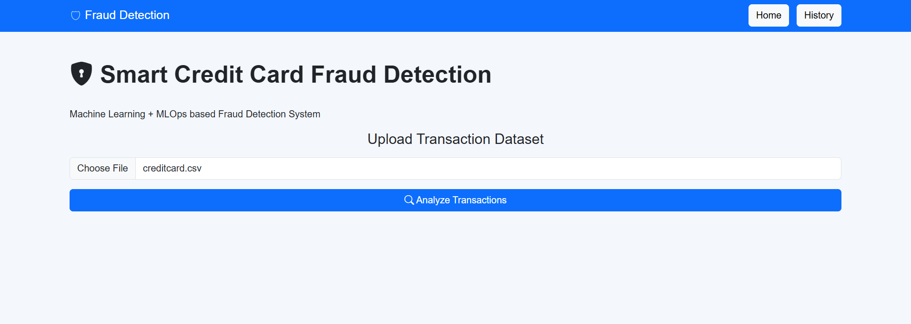
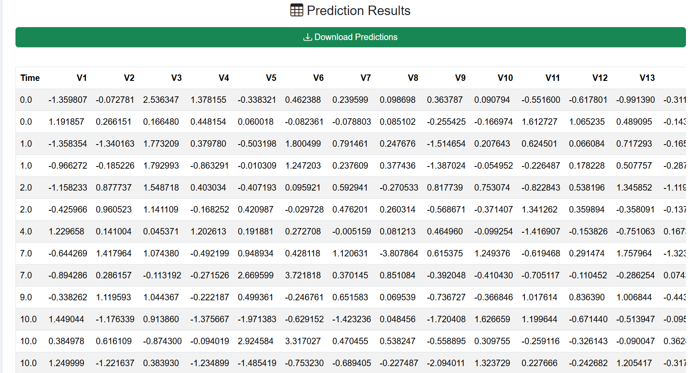
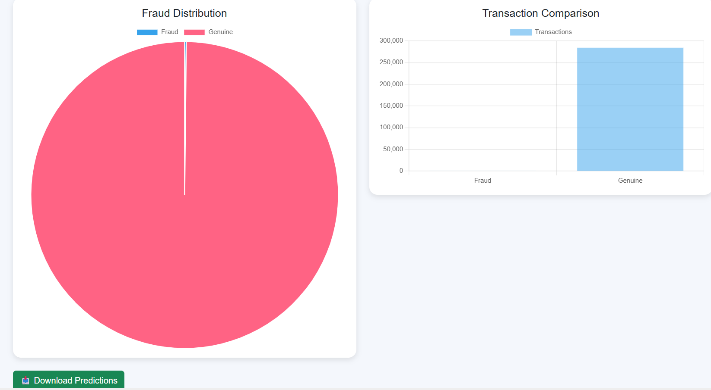
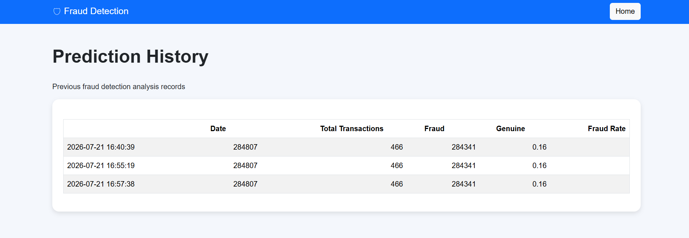

# Smart Credit Card Fraud Detection Dashboard

A Machine Learning + MLOps based web application that detects fraudulent credit card transactions.

## Features

- Machine Learning fraud prediction
- Flask web application
- Interactive dashboard
- Fraud statistics visualization
- Prediction download
- Prediction history tracking

## Technologies Used

- Python
- Flask
- Pandas
- Scikit-learn
- Machine Learning
- HTML/CSS/Bootstrap
- Chart.js

## Project Architecture

Dataset → Data Processing → ML Model → Flask API → Dashboard

## How to Run

Install dependencies:

pip install -r requirements.txt

Run application:

python app.py

Open:

http://127.0.0.1:5000

---

## 📸 Screenshots

### Dashboard

### Prediction Results

### Fraud Analysis Chart

### History

---

## 🔮 Future Improvements

- Deploy using Docker and Cloud platforms
- Add user authentication
- Add real-time transaction monitoring
- Implement advanced ML models
- Add model performance monitoring

---

## 👨‍💻 Author

**B. Dhanush**

Artificial Intelligence and Machine Learning Student

---

⭐ If you find this project useful, consider giving it a star!